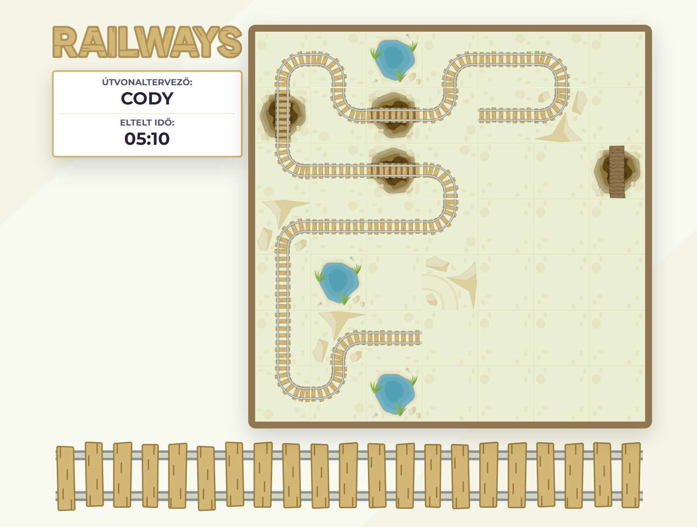

# 🚂 Railways - Interactive Train Track Building Game

This project was developed as a **university assignment**, featuring a train track building puzzle game where players must create efficient railway networks while considering terrain obstacles and time constraints.

## 🚀 Features

- **Dynamic Game Board**: Random maps with varying difficulty levels (5x5 and 7x7).
- **Interactive Track Building**: Place and rotate tracks with intuitive mouse controls.
- **Multiple Track Types**: Handle different terrain types (mountains, bridges, oases).
- **Progress Tracking**: Real-time timer and completion validation.
- **High Score System**: Local storage-based leaderboard system.
- **Responsive Design**: Bootstrap-powered UI that works across devices.

## 🎮 Gameplay

- Choose difficulty level (Easy 5x5 or Hard 7x7).
- Place tracks using left mouse click.
- Rotate tracks by clicking again.
- Remove tracks using right mouse click.
- Complete the railway circuit while avoiding obstacles.
- Try to achieve the fastest completion time.

## 💻 Technologies

- **HTML**
- **CSS** with Bootstrap 5
- **Vanilla JavaScript** (ES6+)
- **Local Storage** for data persistence
- **Modular Design Pattern**

## 📸 Preview

## 📋 Project Details

- **University**: ELTE
- **Year**: 2024

---

⭐ This was a university project and is not actively maintained.
